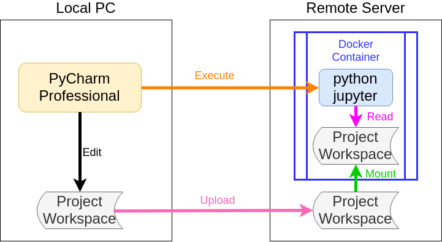
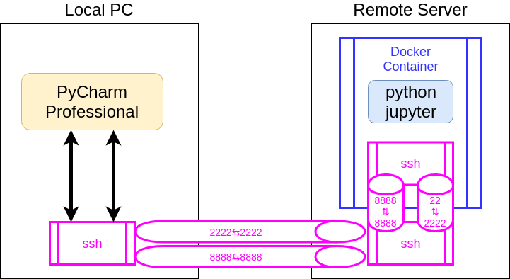

# Remote PC の Docker Container 上の Python 実行環境を Local PC の PyCharm から利用する

Python で開発をしていると IDE が欲しくなります。
Python の IDE として現在とても使いやすいと感じているのが、[PyCharm][]です。

また、Python で開発しているプロジェクトは Deep Learning を利用したものであり、
その Training/Validation/Testing に GPU を使う必要があります。
GPU を搭載したサーバは複数の開発者からアクセスできるリモートにあります。
当然ながら、Deep Learning 開発環境の構築には、
開発ツール/ライブラリ/フレームワーク/GPUドライバのバージョン依存が問題になるため、
[Docker][] Container を用意して、その上で開発環境を構築します。

手元のPC上で作成したコード群を変更するたびに、
Remote PC の Docker Container 上にコピーしてデバッグして修正して、
を繰り返すのはとても長く辛い開発になります。

つまり、手元のPCで [PyCharm][] を使いつつ、
動作環境はリモートPCの Docker Container を使用する。
という環境を使いたくなります。

このメモは、それを実現するためのものです。

この開発環境の全体像を以下に示します。


また、必要となる SSH Tunnel は以下です。
Port 8888 は Jupyter Notebook を実行するためのものです。


- - -
# Remote Server & Docker Container の準備 

GPUを使用するため、[NGC][]から [PyTorch][]用の Container Image をダウンロードします。
その後で、Container のセットアップをします(詳細な設定内容については割愛します)。

- - -
以下は実際に [CenterNet][] の動作に必要な [Python][] 環境を
[Docker][] Container 上に構築した例です。

[Python][] 環境は conda を使用します。
[CenterNet][] では、 [Python][], [PyTorch][], OpenCV などのバージョン依存がありますので、
注意してインストールする必要がありました。
```bash
root@centernet:~# conda create --name CenterNet python=3.6
root@centernet:~# conda init
root@centernet:~# exit
$ docker exec -it centernet bash
(base) root@centernet:/workspace# conda activate CenterNet
(CenterNet) root@centernet:~# conda update -n base -c defaults conda
(CenterNet) root@centernet:~# conda install pytorch=1.1 torchvision -c pytorch
(CenterNet) root@centernet:~# conda install Cython
(CenterNet) root@centernet:~# conda install -c conda-forge opencv=4.1.1
(CenterNet) root@centernet:~# conda install -c conda-forge numba easydict scipy
(CenterNet) root@centernet:~# conda install -c conda-forge progress matplotlib
(CenterNet) root@centernet:~# apt install libgl1-mesa-glx
(CenterNet) root@centernet:~# conda install -c conda-forge pycocotools
```
- - -

そうやって[CenterNet][]用のイメージ(ここでは centernet:1.0 としています)を作成した後、
Containerを生成するときのスクリプトを以下のようにします。
```bash
docker run --detach \
        -p 8888:8888 \
        -p 2222:22 \
        --privileged \
        --gpus all \
        --shm-size=1g --ulimit memlock=-1 \
        -it \
        -v /home/my_project:/workspace/my_project \
        --hostname centernet \
        --name centernet \
        centernet:1.0
```
`-p`オプションで Remote Server から Docker Container へのポート転送設定を行います。
* Port`8888:8888` は Jupyter用です
* Port`2222:22`はSSH用です

`-v`オプションで Remote Server 上のディレクトリを
Docker Container 上にマウントします。
* Remote Server 上のディレクトリが `/home/my_project` です
* Docker Container 上のマウントポイントが `/workspace/my_project` です

上記のコマンドによって、ポート転送をディレクトリのマウントができます。
しかし、Docker Container上では sshd が起動していないため、
ssh でアクセスすることができません。

- - -
## Docker Container 上で sshd を準備

まずは Docker Container に sshd をインストールします。
```bash
(base) root@centernet:~# apt install openssh-server
```

Local PC の Pycharm から Docker Container には root アカウントでログインしているため、
以下のようにログインを許可しておきます。
パスワードログインを許可しているのはメンテナンスのためです。
実際には、公開鍵を登録して、それを使ってログインします(パスフレーズなし)。

```bash
(base) root@centernet:~# vim /etc/ssh/sshd_config
```
```diff
--- sshd_config.orig    2019-10-24 17:03:39.993604170 +0000
+++ sshd_config 2019-10-24 16:59:20.989606640 +0000
@@ -30,11 +30,13 @@

 #LoginGraceTime 2m
 #PermitRootLogin prohibit-password
+PermitRootLogin yes
 #StrictModes yes
 #MaxAuthTries 6
 #MaxSessions 10

 #PubkeyAuthentication yes
+PubkeyAuthentication yes

 # Expect .ssh/authorized_keys2 to be disregarded by default in future.
 #AuthorizedKeysFile    .ssh/authorized_keys .ssh/authorized_keys2
@@ -54,6 +56,7 @@

 # To disable tunneled clear text passwords, change to no here!
 #PasswordAuthentication yes
+PasswordAuthentication yes
 #PermitEmptyPasswords no

 # Change to yes to enable challenge-response passwords (beware issues with
```

root のパスワードは適当に設定しておきます。
```bash
(base) root@centernet:~# passwd root
```

sshd のテストとして Docker Container で sshd を起動して、
```bash
(base) root@centernet:~# /etc/init.d/ssh start
* Starting OpenBSD Secure Shell server sshd                 [OK]
```
Remote Server から root アカウントでログインしてみます。
```bash
$ slogin -p 2222 root@localhost
(base) root@centernet:~#
```
ログインできました。

## Docker Container 上で jupyter を準備

Jupyter 利用上のアクセス制限を外します。

まずは、設定ファイルを生成します。
```bash
(base) root@centernet:~# conda activate CenterNet
(CenterNet) root@centernet:~# jupyter lab --generate-config
Writing default config to: /root/.jupyter/jupyter_noetbook_config.py
```
そしてアクセス関連のパラメタを変更します。
```bash
(CenterNet) root@centernet:~# vim /root/.jupyter/jupyter_noetbook_config.py
```

```diff
--- jupyter_notebook_config.py.orig     2019-10-24 15:27:12.145659367 +0000
+++ jupyter_notebook_config.py  2019-10-24 15:35:29.173654627 +0000
@@ -82,7 +82,7 @@
 #c.NotebookApp.allow_remote_access = False

 ## Whether to allow the user to run the notebook as root.
-#c.NotebookApp.allow_root = False
+c.NotebookApp.allow_root = True

 ## DEPRECATED use base_url
 #c.NotebookApp.base_project_url = '/'
@@ -202,6 +202,7 @@

 ## The IP address the notebook server will listen on.
 #c.NotebookApp.ip = 'localhost'
+c.NotebookApp.ip = '0.0.0.0'

 ## Supply extra arguments that will be passed to Jinja environment.
 #c.NotebookApp.jinja_environment_options = {}
@@ -258,7 +259,7 @@
 #c.NotebookApp.nbserver_extensions = {}

 ## The directory to use for notebooks and kernels.
-#c.NotebookApp.notebook_dir = ''
+c.NotebookApp.notebook_dir = '/workspace/my_project'

 ## Whether to open in a browser after starting. The specific browser used is
 #  platform dependent and determined by the python standard library `webbrowser`
@@ -273,7 +274,7 @@
 #    from notebook.auth import passwd; passwd()
 #
 #  The string should be of the form type:salt:hashed-password.
-#c.NotebookApp.password = ''
+c.NotebookApp.password = ''

 ## Forces users to use a password for the Notebook server. This is useful in a
 #  multi user environment, for instance when everybody in the LAN can access each
@@ -284,7 +285,7 @@
 #c.NotebookApp.password_required = False

 ## The port the notebook server will listen on.
-#c.NotebookApp.port = 8888
+c.NotebookApp.port = 8888

 ## The number of additional ports to try if the specified port is not available.
 #c.NotebookApp.port_retries = 50
@@ -337,7 +338,7 @@
 #
 #  Setting to an empty string disables authentication altogether, which is NOT
 #  RECOMMENDED.
-#c.NotebookApp.token = '<generated>'
+c.NotebookApp.token = ''

 ## Supply overrides for the tornado.web.Application that the Jupyter notebook
 #  uses.
```

jupyter lab のテストとして、 Docker Container で jupyter lab を起動して、
```bash
(CenterNet) root@centernet:~# jupyter lab --config=/root/.jupyter/jupyter_noetbook_config.py
```

Local PCからブラウザで以下のURLにアクセスしてみます。  
`http://<Remote Server のIPアドレス>:8888`  
アクセスできました。

# Local PC の準備

- - -
[PyCharm]: https://www.jetbrains.com/pycharm/
[Docker]: https://www.docker.com/
[NGC]: https://ngc.nvidia.com/
[PyTorch]: https://pytorch.org/
[Python]: https://www.python.org/
[CenterNet]: https://github.com/xingyizhou/CenterNet
